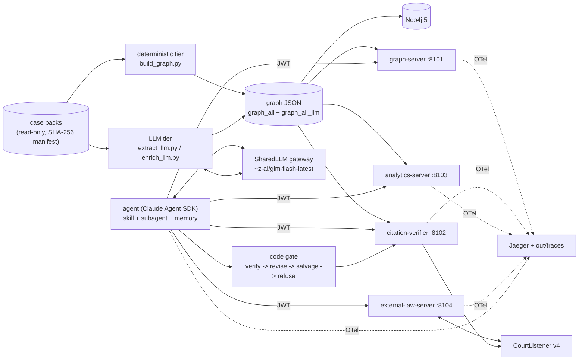

# LISA architecture

LISA answers legal research questions over two corpora (30 BIA / Attorney General immigration decisions, 30 U.S.
Supreme Court opinions) by letting an LLM agent query a knowledge graph through MCP tools, and refusing to deliver
any answer whose citations do not pass a deterministic verifier. This page maps the spec's six layers to code.
Technology choices and their alternatives are in [decision_log.md](decision_log.md).

Full diagram (data flow, ports, budgets): [`diagrams/architecture.mmd`](../diagrams/architecture.mmd).

## L1 - knowledge graph (`src/lisa/graph`, `src/lisa/extract`)

| tier | produced by | nodes / edges | provenance |
|---|---|---|---|
| deterministic | `scripts/build_graph.py` (`graph/extract_det.py`, `canon.py`, `statutes.py`, `crossdomain.py`) | Case, Authority, Statute, Regulation, Page; CITES (internal / cross_domain / external), MENTIONS_STATUTE, HAS_PAGE | `deterministic`, confidence 1.0 or name-match score |
| LLM | `scripts/extract_llm.py` (gold schema, scored), `scripts/enrich_llm.py` (the 60 served cases) | Doctrine, Judge; FOLLOWS, DISTINGUISHES, OVERRULES, INVOKES_DOCTRINE, AUTHORED_BY | `llm` when the model's supporting quote is found on the page, else `unverified` (kept out of the served graph) |

The two tiers are written to separate files (`out/graph_<ds>.json`, `out/graph_<ds>_llm.json`) and merged only at
load time, so the LLM tier can be dropped or rebuilt without touching the deterministic one. Domains are YAML
(`config/domains/*.yaml`, `config/datasets/*.yaml`): switching corpus is a config change. Every node and edge carries
`provenance`, `confidence` and page-anchored `evidence`; case legal status is always `not verified`.
Neo4j is the system of record (`scripts/load_neo4j.py`); the servers can also serve from an in-memory store built
from the same JSON (`serve.backend: memory | neo4j`), which keeps tests and laptops infrastructure-free.

## L2 - MCP tool layer (`src/lisa/servers`, `src/lisa/tools`, `src/lisa/store`)

Four FastMCP servers over streamable HTTP, launched together by `scripts/serve_all.py` or one container each.

| server | tools (researcher) | admin-only |
|---|---|---|
| graph | search_cases, search_case_text, get_case, read_page, find_citing_cases, find_cited_cases, precedent_chain | graph_stats, run_cypher (read-only) |
| citation-verifier | verify_citation, verify_answer | - |
| analytics | most_cited_precedents (PageRank / in-degree), statute_frequency, doctrine_influence, cross_corpus_bridges | refresh_analytics |
| external-law | resolve_citation, search_opinions, get_opinion_cluster, get_docket, quota_status | clear_cache |

Untrusted text leaves the servers only inside `<<<UNTRUSTED_CASE_TEXT ... UNTRUSTED_CASE_TEXT>>>` fences with
injection flags (`common/untrusted.py`): `read_page` and search snippets via `fence`, and every free-text field
(`quote`, `snippet`, `syllabus`, `case_name`, `caption`, `cause`, `nature_of_suit`) at any depth of a graph or
external-law tool result via `fence_fields`. Fence markers inside the text are defanged.

**Citation verifier** (`tools/verifier.py`, quote matching in `extract/verify.py`). A citation resolves to a corpus
case or, for an out-of-corpus reporter citation, to CourtListener. Tiers: `verified_in_corpus` (in-corpus case and
the quote is on its stored pages, whitespace / dashes / quote marks normalized), `resolved_externally`, `unverified`.
`verify_answer` checks a draft against its numbered citations:

- at least one citation, every citation verified; no dangling `[n]` markers and no unused citations;
- quotations in the prose (double, curly, guillemet and single quotes; each style pairs only with itself, so nested
  quotes work) are checked too: 1-2 word quoted terms, bare citations and the status label are skipped; 3-4 word
  terms must be on a page of some cited in-corpus case; longer quotations on a page of the case cited by their own
  marker (the first `[n]` after the quote on its line, else the last one before it); an unattributed quotation fails;
- ellipsis pieces must appear in order, each gap at most `MAX_ELLIPSIS_GAP` (300 squashed chars), on one page or two
  adjacent pages (a different cited page is only noted); `locate` is bounded (`MAX_PIECES` 12 pieces, `MAX_STARTS`
  50 start positions);
- bracket alterations are accepted only as case changes of the same letters (`[b]ut`); omissions (`treat[]`) and
  insertions (`[did not]`) stay literal;
- sentences with legal cues (case-insensitive) or reporter citations need a marker; short all-caps headings are
  exempt only when they contain no assertion; source / disclaimer lines are exempt;
- "good law" claims need a "not verified" qualifier;
- external citations: a quote is rejected (the source text is not stored) and the given case name must match the
  name CourtListener resolved.

CourtListener calls (`common/courtlistener.py`) go through a disk cache keyed by request, a persisted
per-minute/hour/day quota ledger, and exponential backoff honouring `Retry-After`; no token, exhausted quota or network failure returns a structured `unavailable` result.

## L3 - agent (`src/lisa/agent`)

`ResearchAgent.ask` runs one research turn with the Claude Agent SDK pointed at the SharedLLM Anthropic-compatible
route (`/anthropic`, model `~z-ai/glm-flash-latest`); the CLI authenticates with the virtual key as bearer plus
`X-SharedLLM-Key` (`sdk_env`). By default the CLI reaches the gateway through a local metering proxy
(`agent/usage_proxy.py`) that records exact token usage per model call, which the gateway omits on streamed
replies. Wired in: the `legal-research` skill
(`agent/.claude/skills/legal-research/SKILL.md`), the `citation-chaser` subagent
(`agent/subagents/citation_chaser.py`), a PreToolUse hook that denies anything outside the MCP tool allowlist and records the trajectory, and `SessionMemory` (`out/sessions/<name>.json` digest + SDK session resume),
so a session survives restarts.

Guardrails are code, not prompt text (`agent/guardrails/gate.py`): the final JSON is parsed, sent to
`verify_answer`, and on failure the model gets the problem list for up to `agent.max_revisions` revisions. If it
still fails, sentences backed only by verified citations are salvaged and re-verified; otherwise the turn is refused.
The delivered text is rendered by code: sources with their verifier tier, a fixed "legal status not verified"
notice, and the advice disclaimer when the question asks for advice. Each turn is appended to
`out/trajectories.jsonl`.

## L4 - evaluation (`src/lisa/eval`, `config/eval`)

- Extraction: `scripts/eval_extraction.py` - evidence-anchored P/R of the LLM tier against the gold standard,
  threshold sweep and error buckets -> `docs/eval/extraction_report.md`.
- QA: `scripts/eval_qa.py` runs the 28-question golden set (`config/eval/golden_questions.yaml`) through the KG
  agent and a vector-RAG baseline (`eval/rag.py`: fastembed bge-small over page chunks, top-8, one call, same model,
  same verifier gate). Scoring (`eval/qa.py`): recall/precision of verified in-corpus citations against expected
  cases, expected behaviour (answer / refuse / disclaimer), latency, tokens, and trajectory checks (required tools
  used, only allowlisted tools, `verify_answer` called by the model). Report: `docs/eval/qa_report.md`, analysed in
  [evaluation_report.md](evaluation_report.md). `--reverify kg` re-checks the stored drafts with the current gate
  (-> `out/eval/reverify_kg.md`), since the verifier was hardened after the run.
- Degradation: a token-less verifier + external server pair with its own `LISA_OUT_DIR`, run beside the normal
  servers on ports moved with `LISA_<NAME>_PORT` (`--tag no_token`).
- Models: the extraction evaluation ran on `gpt-oss:120b` (history, cached); QA on `~z-ai/glm-flash-latest` from the pool.

## L5 - security and operations

HS256 JWTs (`common/auth.py`) with `researcher` / `admin` roles on every server; a weak or placeholder
`LISA_AUTH_SECRET` (< 32 chars, `REPLACE...`, `change-me`) is refused; threat analysis in
[threat_model.md](threat_model.md). OpenTelemetry spans for agent turns, tool calls, verifier gate decisions and
server tool executions (`common/tracing.py`) go to Jaeger over OTLP/HTTP and to `out/traces/*.jsonl`.
`docker-compose.yml` brings up Neo4j, Jaeger, the four servers and (on demand) the agent; secrets come only from
`.env`, each server gets only the secrets it uses, the agent gets the SharedLLM key and a pre-issued researcher
token (never the signing secret), and all ports bind to 127.0.0.1. Containers run as `LISA_UID:LISA_GID` (the
host user, so the `./out` bind mount is writable); the image installs the package editable so
`config/` resolves from the source tree.
GitHub Actions (`.github/workflows/docker.yml`) builds both images and runs the stack live against a synthetic corpus
(`scripts/ci_synthetic_data.py`); `scripts/ci_smoke.py` checks auth, roles, tools and the no-token degradation over
HTTP, on the memory and the Neo4j backend, and the agent image is started. Rate-limit budgets: see
[model_constraints.md](model_constraints.md).

## Data never in the repo

The case packs are mounted read-only from `LISA_DATA_DIR`. The repo holds the subset checksums (`data_manifest/manifest.json`) and
`scripts/rebuild.sh` / `rebuild.ps1`, which verify the packs and rebuild every graph from scratch.
